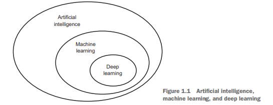
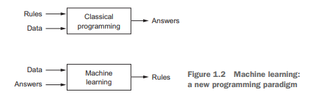
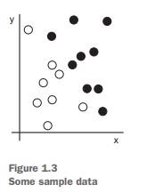
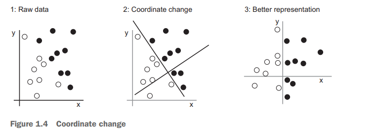
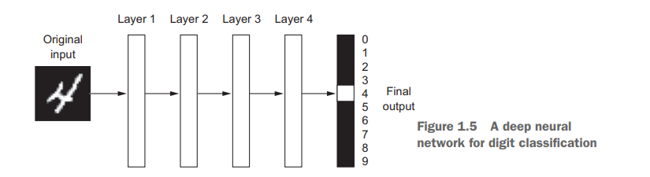
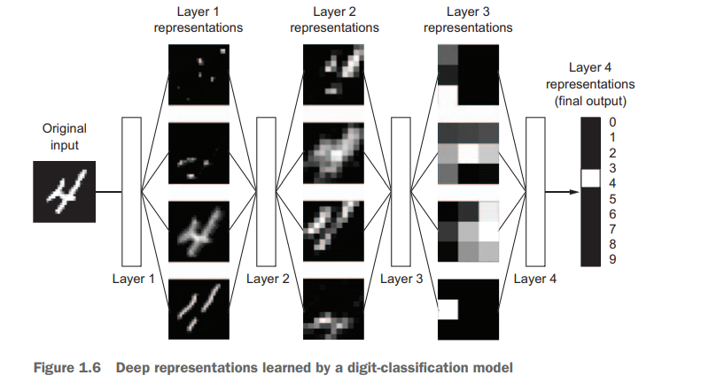
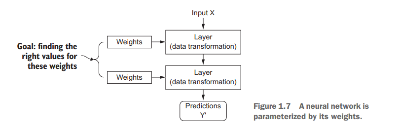
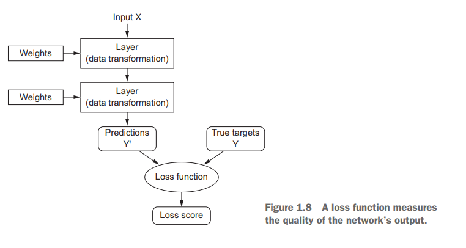
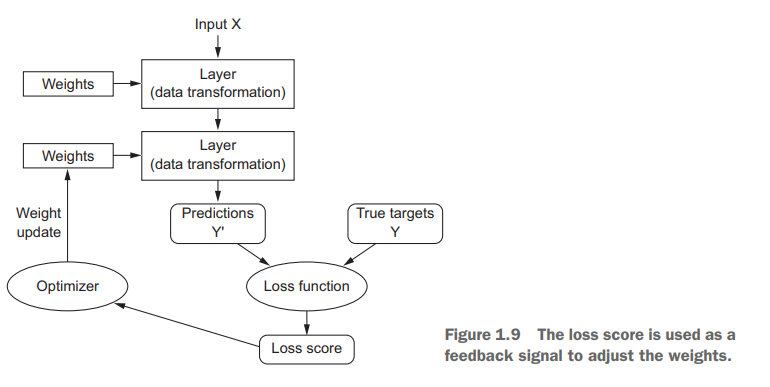

# Deep Learning 
# Phần 1: Các nguyên tắc cơ bản của deep learning
Chương 1–4 trong cuốn sách này sẽ cung cấp cho bạn kiến thức nền tảng về deep learning, giúp bạn hiểu rõ nó là gì, có thể làm được gì và cách nó hoạt động. Phần này cũng sẽ giúp bạn làm quen với quy trình làm việc tiêu chuẩn để giải quyết các vấn đề dữ liệu bằng cách sử dụng deep learning.

## 1. What is deep learning?
### 1.1 Artificial intelligence, machine learning, and deep learning
Trước tiên, chúng ta cần định nghĩa rõ ràng những gì chúng ta đang đề cập đến khi nhắc đến AI. Trí tuệ nhân tạo (AI), machine learning, và deep learning là gì? Và chúng liên quan đến nhau như thế nào?\

#### 1.1.1 Artificial intelligence
- AI ra đời vào thập niên 1950: Đây là thời kỳ các nhà khoa học bắt đầu khám phá liệu máy tính có thể suy nghĩ như con người không.
- **Định nghĩa AI**: AI là nỗ lực tự động hóa các nhiệm vụ trí tuệ của con người, bao gồm cả machine learning và deep learning, nhưng cũng có các phương pháp không yêu cầu học.
- AI biểu tượng (symbolic AI): Phương pháp AI ban đầu dựa vào các quy tắc được lập trình thủ công, được áp dụng phổ biến từ thập niên 1950 đến cuối thập niên 1980.
- Hệ thống chuyên gia: Là đỉnh cao của AI biểu tượng vào thập niên 1980, được thiết kế để giải quyết các vấn đề logic đơn giản như chơi cờ vua.
- Giới hạn của AI biểu tượng: Không thể giải quyết các vấn đề phức tạp như nhận dạng hình ảnh hay giọng nói, dẫn đến sự xuất hiện của machine learning.
#### 1.1.2 Machine learning
Ada Lovelace và Máy phân tích: Máy phân tích của Charles Babbage, ra đời vào những năm 1830, là máy tính cơ khí đa năng đầu tiên, nhưng không được thiết kế như một máy tính đa năng như ngày nay.

Nhận xét của Ada Lovelace: Ada Lovelace đã nói rằng Máy phân tích không thể tự sáng tạo mà chỉ thực hiện những gì con người ra lệnh, một nhận xét sau này được Alan Turing trích dẫn trong nghiên cứu về khả năng học hỏi của máy tính.

Machine learning: Học máy nảy sinh từ câu hỏi liệu máy tính có thể học cách tự thực hiện nhiệm vụ thay vì lập trình viên phải tạo ra các quy tắc xử lý dữ liệu thủ công. Machine learning huấn luyện máy tính từ dữ liệu để tự động hóa các nhiệm vụ.\

Sự phát triển của machine learning: Machine learning bắt đầu nở rộ vào những năm 1990, trở thành một lĩnh vực thành công trong AI, được hỗ trợ bởi phần cứng nhanh hơn và lượng dữ liệu lớn.

Sự khác biệt với thống kê: Machine learning khác với thống kê ở chỗ nó xử lý các tập dữ liệu lớn và phức tạp hơn, và hướng nhiều đến thực nghiệm và kỹ thuật hơn là lý thuyết toán học.

#### 1.1.3 Learning representations from data
Yếu tố cần thiết cho machine learning:

Dữ liệu đầu vào: Ví dụ là tệp âm thanh cho nhận dạng giọng nói hoặc ảnh cho gắn thẻ hình ảnh.
Đầu ra mong đợi: Ví dụ là bản chép lời hoặc thẻ hình ảnh như "chó", "mèo".
Cách đo lường hiệu quả: Ví dụ tỷ lệ phần trăm chính xác của kết quả so với đầu ra mong đợi.
Biểu diễn dữ liệu: Là cách mà dữ liệu được mã hóa hoặc biểu diễn, giúp giải quyết các nhiệm vụ cụ thể. Ví dụ, định dạng RGB và HSV cho hình ảnh màu là hai cách biểu diễn khác nhau của cùng một dữ liệu.

**Mục tiêu của machine learning**: Tìm ra các biểu diễn thích hợp của dữ liệu đầu vào để thực hiện nhiệm vụ như phân loại.

Hãy cụ thể hóa điều này. Xem xét một trục x, một trục y và một số điểm được biểu diễn bằng tọa độ của chúng trong hệ (x, y), như được thể hiện trong hình 1.3. Như bạn có thể thấy, chúng ta có một vài điểm trắng và một vài điểm đen. Giả sử chúng ta muốn phát triển một thuật toán có thể lấy tọa độ (x, y) của một điểm và đầu ra xem liệu điểm đó có khả năng là màu đen hay màu trắng. Trong trường hợp này:

- **Dữ liệu đầu vào** là tọa độ của các điểm.
- **Các đầu ra mong đợi** là màu sắc của các điểm.
- **Cách đo lường thuật toán** có thể là, ví dụ, tỷ lệ phần trăm các điểm được phân loại đúng.

Điều chúng ta cần ở đây là một biểu diễn mới của dữ liệu có thể tách biệt rõ ràng các điểm trắng với các điểm đen. Một phép biến đổi mà chúng ta có thể sử dụng, trong số nhiều khả năng khác, là một sự thay đổi hệ tọa độ, được minh họa trong hình 1.4.\

Trong hệ tọa độ mới này, tọa độ của các điểm có thể được coi là biểu diễn mới của dữ liệu. Và đó là một biểu diễn tốt! Với biểu diễn này, bài toán phân loại đen/trắng có thể được diễn đạt bằng một quy tắc đơn giản: “Các điểm đen là những điểm có x > 0,” hoặc “Các điểm trắng là những điểm có x < 0.” Biểu diễn mới này về cơ bản đã giải quyết được vấn đề phân loại.

Trong trường hợp này, chúng ta đã xác định sự thay đổi hệ tọa độ bằng tay. Nhưng nếu thay vào đó, chúng ta tìm kiếm có hệ thống các thay đổi tọa độ khác nhau và sử dụng tỷ lệ phần trăm các điểm được phân loại đúng làm tín hiệu phản hồi, thì chúng ta đang thực hiện machine learning. **Học**, trong bối cảnh machine learning, mô tả quá trình tìm kiếm tự động các biểu diễn tốt hơn.

Tất cả các thuật toán machine learning đều bao gồm việc tự động tìm ra các phép biến đổi để biến dữ liệu thành các biểu diễn hữu ích hơn cho một nhiệm vụ cụ thể. Các phép biến đổi này có thể là thay đổi tọa độ, như bạn vừa thấy, hoặc phép chiếu tuyến tính (có thể làm mất thông tin), dịch chuyển, phép toán phi tuyến tính (chẳng hạn như "chọn tất cả các điểm sao cho x > 0"), và nhiều phép toán khác. **Thuật toán machine learning thường không sáng tạo trong việc tìm ra các phép biến đổi này; chúng chỉ tìm kiếm trong một tập hợp các phép biến đổi đã được định nghĩa trước, gọi là không gian giả thuyết (hypothesis space)**.

Về mặt kỹ thuật, machine learning là tìm kiếm biểu diễn hữu ích của dữ liệu đầu vào, trong phạm vi một không gian các khả năng được xác định trước, sử dụng tín hiệu phản hồi để định hướng. Ý tưởng đơn giản này cho phép giải quyết một loạt các nhiệm vụ trí tuệ, từ nhận dạng giọng nói đến lái xe tự động.

Bây giờ khi bạn đã hiểu khái niệm học, hãy xem điều gì làm cho **deep learning** đặc biệt.

#### 1.1.4 The “deep” in deep learning
Deep learning là một lĩnh vực con của machine learning và tập trung vào việc học các lớp biểu diễn kế tiếp nhau với mức độ phức tạp tăng dần. Số lớp được gọi là độ sâu của mô hình.

Deep learning không phải là một mô hình của bộ não, dù một số khái niệm ban đầu được lấy cảm hứng từ sinh học thần kinh. Không có bằng chứng cho thấy não thực hiện các cơ chế học tương tự như deep learning.

Trong khi deep learning học nhiều lớp biểu diễn, shallow learning (học nông) chỉ tập trung vào một hoặc hai lớp.

Deep learning là một khung toán học để học các biểu diễn từ dữ liệu, không phải là một hệ thống mô phỏng bộ não con người, và không nên nhầm lẫn với sinh học thần kinh.

Các biểu diễn mà một thuật toán deep learning học được trông như thế nào? Hãy xem xét cách mà một mạng nhiều lớp (xem hình 1.5) biến đổi một hình ảnh của một chữ số để nhận diện xem đó là chữ số nào.\

Như bạn có thể thấy trong hình 1.6, mạng nơ-ron biến đổi hình ảnh chữ số thành các biểu diễn càng ngày càng khác so với hình ảnh ban đầu và ngày càng cung cấp nhiều thông tin hơn về kết quả cuối cùng. Bạn có thể hình dung một mạng deep learning như một quá trình tinh lọc thông tin nhiều giai đoạn, trong đó thông tin đi qua các bộ lọc kế tiếp và dần dần trở nên tinh lọc hơn (tức là hữu ích hơn đối với một nhiệm vụ cụ thể).\

Về mặt kỹ thuật, đó là deep learning: một cách học biểu diễn dữ liệu qua nhiều giai đoạn. Đây là một ý tưởng đơn giản — nhưng, như hóa ra, các cơ chế rất đơn giản khi được mở rộng đủ lớn có thể trông giống như phép màu.

#### 1.1.5 Understanding how deep learning works, in three figures
Machine learning: Quá trình ánh xạ dữ liệu đầu vào (như hình ảnh) với các mục tiêu (nhãn) bằng cách học từ nhiều ví dụ.

Quá trình mà một lớp thực hiện trên dữ liệu đầu vào được lưu trữ trong các trọng số (weights) của lớp, mà về cơ bản là một tập hợp các con số. Về mặt kỹ thuật, chúng ta có thể nói rằng phép biến đổi do một lớp thực hiện được tham số hóa (parameterized) bởi các trọng số của nó (xem hình 1.7). (Trọng số cũng đôi khi được gọi là tham số của một lớp.) Trong ngữ cảnh này, học nghĩa là tìm ra một tập hợp giá trị cho các trọng số của tất cả các lớp trong mạng, sao cho mạng có thể ánh xạ chính xác đầu vào mẫu sang các mục tiêu tương ứng.

**Thách thức**: Một mạng nơ-ron sâu có thể có hàng chục triệu tham số, và việc điều chỉnh một tham số có thể ảnh hưởng đến tất cả các tham số khác, làm cho quá trình học trở nên phức tạp.

Để kiểm soát một thứ gì đó, trước tiên bạn cần có khả năng quan sát nó. Để kiểm soát đầu ra của một mạng nơ-ron, bạn cần có khả năng đo lường xem đầu ra đó cách xa bao nhiêu so với những gì bạn mong đợi. Đây là nhiệm vụ của hàm mất mát (**loss function**) của mạng, còn được gọi là hàm mục tiêu (objective function). Hàm mất mát lấy dự đoán của mạng và mục tiêu thực sự (những gì bạn muốn mạng nơ-ron đưa ra) và tính toán một điểm số khoảng cách, thể hiện mức độ tốt mà mạng đã thực hiện trên ví dụ cụ thể này (xem hình 1.8).\

Mẹo cơ bản trong deep learning là **sử dụng điểm số mất mát này như một tín hiệu phản hồi để điều chỉnh giá trị của các trọng số** một chút, theo hướng làm giảm điểm số mất mát cho ví dụ hiện tại (xem hình 1.9). Việc điều chỉnh này là nhiệm vụ của **bộ tối ưu hóa (optimizer)**, bộ thực hiện cái được gọi là thuật toán lan truyền ngược (**Backpropagation algorithm**) — thuật toán trung tâm trong deep learning. Chương tiếp theo sẽ giải thích chi tiết hơn về cách backpropagation hoạt động.\

Ban đầu, các **trọng số** của mạng được gán các giá trị ngẫu nhiên, do đó mạng chỉ thực hiện một loạt các phép biến đổi ngẫu nhiên. Tất nhiên, đầu ra của mạng lúc này sẽ rất khác so với những gì nó cần phải là, và **điểm số mất mát** tương ứng sẽ rất cao. Nhưng với mỗi ví dụ mà mạng xử lý, các trọng số được điều chỉnh một chút theo hướng đúng, và điểm số mất mát giảm dần. Đây chính là vòng lặp huấn luyện (**training loop**), lặp lại đủ số lần (thường là hàng chục lần trên hàng ngàn ví dụ), tạo ra các giá trị trọng số giúp **tối thiểu hóa hàm mất mát**. Một mạng có mất mát tối thiểu là một mạng có đầu ra gần nhất có thể với mục tiêu — tức là **một mạng đã được huấn luyện**. Một lần nữa, đó là một cơ chế đơn giản nhưng khi được mở rộng đủ lớn, lại trông giống như phép màu.
#### 1.1.6 What deep learning has achieved so far

