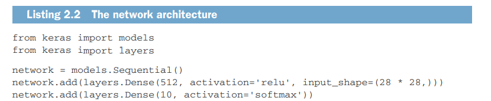

# Deep Learning - 
# Phần 1: Các nguyên tắc cơ bản của deep learning
Chương 1–4 trong cuốn sách này sẽ cung cấp cho bạn kiến thức nền tảng về deep learning, giúp bạn hiểu rõ nó là gì, có thể làm được gì và cách nó hoạt động. Phần này cũng sẽ giúp bạn làm quen với quy trình làm việc tiêu chuẩn để giải quyết các vấn đề dữ liệu bằng cách sử dụng deep learning.

## 1. What is deep learning?
### 1.1 Artificial intelligence, machine learning, and deep learning
Trước tiên, chúng ta cần định nghĩa rõ ràng những gì chúng ta đang đề cập đến khi nhắc đến AI. Trí tuệ nhân tạo (AI), machine learning, và deep learning là gì? Và chúng liên quan đến nhau như thế nào?\

#### 1.1.1 Artificial intelligence
- AI ra đời vào thập niên 1950: Đây là thời kỳ các nhà khoa học bắt đầu khám phá liệu máy tính có thể suy nghĩ như con người không.
- **Định nghĩa AI**: AI là nỗ lực tự động hóa các nhiệm vụ trí tuệ của con người, bao gồm cả machine learning và deep learning, nhưng cũng có các phương pháp không yêu cầu học.
- AI biểu tượng (**symbolic AI**): Phương pháp AI ban đầu dựa vào các quy tắc được lập trình thủ công, được áp dụng phổ biến từ thập niên 1950 đến cuối thập niên 1980.
- Hệ thống chuyên gia: Là đỉnh cao của AI biểu tượng vào thập niên 1980, được thiết kế để giải quyết các vấn đề logic đơn giản như chơi cờ vua.
- Giới hạn của AI biểu tượng: Không thể giải quyết các vấn đề phức tạp như nhận dạng hình ảnh hay giọng nói, dẫn đến sự xuất hiện của machine learning.
#### 1.1.2 Machine learning
Ada Lovelace và Máy phân tích: Máy phân tích của Charles Babbage, ra đời vào những năm 1830, là máy tính cơ khí đa năng đầu tiên, nhưng không được thiết kế như một máy tính đa năng như ngày nay.

Nhận xét của Ada Lovelace: Ada Lovelace đã nói rằng Máy phân tích không thể tự sáng tạo mà chỉ thực hiện những gì con người ra lệnh, một nhận xét sau này được Alan Turing trích dẫn trong nghiên cứu về khả năng học hỏi của máy tính.

Machine learning: Học máy nảy sinh từ câu hỏi liệu máy tính có thể học cách tự thực hiện nhiệm vụ thay vì lập trình viên phải tạo ra các quy tắc xử lý dữ liệu thủ công. Machine learning huấn luyện máy tính từ dữ liệu để tự động hóa các nhiệm vụ.\

Sự phát triển của machine learning: Machine learning bắt đầu nở rộ vào những năm 1990, trở thành một lĩnh vực thành công trong AI, được hỗ trợ bởi phần cứng nhanh hơn và lượng dữ liệu lớn.

Sự khác biệt với thống kê: Machine learning khác với thống kê ở chỗ nó xử lý các tập dữ liệu lớn và phức tạp hơn, và hướng nhiều đến thực nghiệm và kỹ thuật hơn là lý thuyết toán học.

#### 1.1.3 Learning representations from data
Yếu tố cần thiết cho machine learning:

Dữ liệu đầu vào: Ví dụ là tệp âm thanh cho nhận dạng giọng nói hoặc ảnh cho gắn thẻ hình ảnh.
Đầu ra mong đợi: Ví dụ là bản chép lời hoặc thẻ hình ảnh như "chó", "mèo".
Cách đo lường hiệu quả: Ví dụ tỷ lệ phần trăm chính xác của kết quả so với đầu ra mong đợi.
Biểu diễn dữ liệu: Là cách mà dữ liệu được mã hóa hoặc biểu diễn, giúp giải quyết các nhiệm vụ cụ thể. Ví dụ, định dạng RGB và HSV cho hình ảnh màu là hai cách biểu diễn khác nhau của cùng một dữ liệu.

**Mục tiêu của machine learning**: Tìm ra các biểu diễn thích hợp của dữ liệu đầu vào để thực hiện nhiệm vụ như phân loại.

Hãy cụ thể hóa điều này. Xem xét một trục x, một trục y và một số điểm được biểu diễn bằng tọa độ của chúng trong hệ (x, y), như được thể hiện trong hình 1.3. Như bạn có thể thấy, chúng ta có một vài điểm trắng và một vài điểm đen. Giả sử chúng ta muốn phát triển một thuật toán có thể lấy tọa độ (x, y) của một điểm và đầu ra xem liệu điểm đó có khả năng là màu đen hay màu trắng. Trong trường hợp này:

- **Dữ liệu đầu vào** là tọa độ của các điểm.
- **Các đầu ra mong đợi** là màu sắc của các điểm.
- **Cách đo lường thuật toán** có thể là, ví dụ, tỷ lệ phần trăm các điểm được phân loại đúng.


Điều chúng ta cần ở đây là một biểu diễn mới của dữ liệu có thể tách biệt rõ ràng các điểm trắng với các điểm đen. Một phép biến đổi mà chúng ta có thể sử dụng, trong số nhiều khả năng khác, là một sự thay đổi hệ tọa độ, được minh họa trong hình 1.4.\


Trong hệ tọa độ mới này, tọa độ của các điểm có thể được coi là biểu diễn mới của dữ liệu. Và đó là một biểu diễn tốt! Với biểu diễn này, bài toán phân loại đen/trắng có thể được diễn đạt bằng một quy tắc đơn giản: “Các điểm đen là những điểm có x > 0,” hoặc “Các điểm trắng là những điểm có x < 0.” Biểu diễn mới này về cơ bản đã giải quyết được vấn đề phân loại.

Trong trường hợp này, chúng ta đã xác định sự thay đổi hệ tọa độ bằng tay. Nhưng nếu thay vào đó, chúng ta tìm kiếm có hệ thống các thay đổi tọa độ khác nhau và sử dụng tỷ lệ phần trăm các điểm được phân loại đúng làm tín hiệu phản hồi, thì chúng ta đang thực hiện machine learning. **Học**, trong bối cảnh machine learning, mô tả quá trình tìm kiếm tự động các biểu diễn tốt hơn.

Tất cả các thuật toán machine learning đều bao gồm việc tự động tìm ra các phép biến đổi để biến dữ liệu thành các biểu diễn hữu ích hơn cho một nhiệm vụ cụ thể. Các phép biến đổi này có thể là thay đổi tọa độ, như bạn vừa thấy, hoặc phép chiếu tuyến tính (có thể làm mất thông tin), dịch chuyển, phép toán phi tuyến tính (chẳng hạn như "chọn tất cả các điểm sao cho x > 0"), và nhiều phép toán khác. **Thuật toán machine learning thường không sáng tạo trong việc tìm ra các phép biến đổi này; chúng chỉ tìm kiếm trong một tập hợp các phép biến đổi đã được định nghĩa trước, gọi là không gian giả thuyết (hypothesis space)**.

Về mặt kỹ thuật, machine learning là tìm kiếm biểu diễn hữu ích của dữ liệu đầu vào, trong phạm vi một không gian các khả năng được xác định trước, sử dụng tín hiệu phản hồi để định hướng. Ý tưởng đơn giản này cho phép giải quyết một loạt các nhiệm vụ trí tuệ, từ nhận dạng giọng nói đến lái xe tự động.

Bây giờ khi bạn đã hiểu khái niệm học, hãy xem điều gì làm cho **deep learning** đặc biệt.

#### 1.1.4 The “deep” in deep learning
Deep learning là một lĩnh vực con của machine learning và tập trung vào việc học các lớp biểu diễn kế tiếp nhau với mức độ phức tạp tăng dần. Số lớp được gọi là độ sâu của mô hình.

Deep learning không phải là một mô hình của bộ não, dù một số khái niệm ban đầu được lấy cảm hứng từ sinh học thần kinh. Không có bằng chứng cho thấy não thực hiện các cơ chế học tương tự như deep learning.

Trong khi deep learning học nhiều lớp biểu diễn, shallow learning (học nông) chỉ tập trung vào một hoặc hai lớp.

Deep learning là một khung toán học để học các biểu diễn từ dữ liệu, không phải là một hệ thống mô phỏng bộ não con người, và không nên nhầm lẫn với sinh học thần kinh.

Các biểu diễn mà một thuật toán deep learning học được trông như thế nào? Hãy xem xét cách mà một mạng nhiều lớp (xem hình 1.5) biến đổi một hình ảnh của một chữ số để nhận diện xem đó là chữ số nào.\


Như bạn có thể thấy trong hình 1.6, mạng nơ-ron biến đổi hình ảnh chữ số thành các biểu diễn càng ngày càng khác so với hình ảnh ban đầu và ngày càng cung cấp nhiều thông tin hơn về kết quả cuối cùng. Bạn có thể hình dung một mạng deep learning như một quá trình tinh lọc thông tin nhiều giai đoạn, trong đó thông tin đi qua các bộ lọc kế tiếp và dần dần trở nên tinh lọc hơn (tức là hữu ích hơn đối với một nhiệm vụ cụ thể).\


Về mặt kỹ thuật, đó là deep learning: một cách học biểu diễn dữ liệu qua nhiều giai đoạn. Đây là một ý tưởng đơn giản — nhưng, như hóa ra, các cơ chế rất đơn giản khi được mở rộng đủ lớn có thể trông giống như phép màu.

#### 1.1.5 Understanding how deep learning works, in three figures
Machine learning: Quá trình ánh xạ dữ liệu đầu vào (như hình ảnh) với các mục tiêu (nhãn) bằng cách học từ nhiều ví dụ.

Quá trình mà một lớp thực hiện trên dữ liệu đầu vào được lưu trữ trong các trọng số (weights) của lớp, mà về cơ bản là một tập hợp các con số. Về mặt kỹ thuật, chúng ta có thể nói rằng phép biến đổi do một lớp thực hiện được tham số hóa (parameterized) bởi các trọng số của nó (xem hình 1.7). (Trọng số cũng đôi khi được gọi là tham số của một lớp.) Trong ngữ cảnh này, học nghĩa là tìm ra một tập hợp giá trị cho các trọng số của tất cả các lớp trong mạng, sao cho mạng có thể ánh xạ chính xác đầu vào mẫu sang các mục tiêu tương ứng.

**Thách thức**: Một mạng nơ-ron sâu có thể có hàng chục triệu tham số, và việc điều chỉnh một tham số có thể ảnh hưởng đến tất cả các tham số khác, làm cho quá trình học trở nên phức tạp.


Để kiểm soát một thứ gì đó, trước tiên bạn cần có khả năng quan sát nó. Để kiểm soát đầu ra của một mạng nơ-ron, bạn cần có khả năng đo lường xem đầu ra đó cách xa bao nhiêu so với những gì bạn mong đợi. Đây là nhiệm vụ của hàm mất mát (**loss function**) của mạng, còn được gọi là hàm mục tiêu (objective function). Hàm mất mát lấy dự đoán của mạng và mục tiêu thực sự (những gì bạn muốn mạng nơ-ron đưa ra) và tính toán một điểm số khoảng cách, thể hiện mức độ tốt mà mạng đã thực hiện trên ví dụ cụ thể này (xem hình 1.8).\


Mẹo cơ bản trong deep learning là **sử dụng điểm số mất mát này như một tín hiệu phản hồi để điều chỉnh giá trị của các trọng số** một chút, theo hướng làm giảm điểm số mất mát cho ví dụ hiện tại (xem hình 1.9). Việc điều chỉnh này là nhiệm vụ của **bộ tối ưu hóa (optimizer)**, bộ thực hiện cái được gọi là thuật toán lan truyền ngược (**Backpropagation algorithm**) — thuật toán trung tâm trong deep learning. Chương tiếp theo sẽ giải thích chi tiết hơn về cách backpropagation hoạt động.\


Ban đầu, các **trọng số** của mạng được gán các giá trị ngẫu nhiên, do đó mạng chỉ thực hiện một loạt các phép biến đổi ngẫu nhiên. Tất nhiên, đầu ra của mạng lúc này sẽ rất khác so với những gì nó cần phải là, và **điểm số mất mát** tương ứng sẽ rất cao. Nhưng với mỗi ví dụ mà mạng xử lý, các trọng số được điều chỉnh một chút theo hướng đúng, và điểm số mất mát giảm dần. Đây chính là vòng lặp huấn luyện (**training loop**), lặp lại đủ số lần (thường là hàng chục lần trên hàng ngàn ví dụ), tạo ra các giá trị trọng số giúp **tối thiểu hóa hàm mất mát**. Một mạng có mất mát tối thiểu là một mạng có đầu ra gần nhất có thể với mục tiêu — tức là **một mạng đã được huấn luyện**. Một lần nữa, đó là một cơ chế đơn giản nhưng khi được mở rộng đủ lớn, lại trông giống như phép màu.
#### 1.1.6 What deep learning has achieved so far
Deep learning chỉ thực sự nổi bật vào đầu thập niên 2010 và đã tạo nên một cuộc cách mạng trong machine learning.

Cụ thể, deep learning đã đạt được những đột phá sau, tất cả đều trong các lĩnh vực mà từ trước đến nay rất khó khăn trong machine learning:

- Phân loại hình ảnh đạt mức gần với con người
- Nhận dạng giọng nói gần như đạt mức con người
- Chuyển đổi chữ viết tay gần như đạt mức con người
- Cải tiến dịch máy
- Cải thiện chuyển văn bản thành giọng nói
- Trợ lý kỹ thuật số như Google Now và Amazon Alexa
- Lái xe tự động đạt gần mức con người
- Cải thiện nhắm mục tiêu quảng cáo, được sử dụng bởi Google, Baidu, và Bing
- Cải thiện kết quả tìm kiếm trên web
- Khả năng trả lời câu hỏi ngôn ngữ tự nhiên
- Chơi cờ vây ở mức siêu phàm

**Tiềm năng trong tương lai**: Deep learning có thể được áp dụng vào nhiều lĩnh vực hơn, bao gồm cả hỗ trợ con người trong khoa học và phát triển phần mềm.

#### 1.1.7 Don’t believe the short-term hype - Đừng tin vào sự thổi phồng ngắn hạn
**Kỳ vọng quá cao về deep learning**: Một số ứng dụng như xe tự lái gần đạt được, nhưng nhiều ứng dụng như đối thoại tự nhiên và dịch máy ở mức con người có thể còn xa vời. Các kỳ vọng về trí thông minh nhân tạo ở cấp độ con người không nên được coi trọng quá mức.

Nguy cơ kỳ vọng quá cao: Nếu kỳ vọng ngắn hạn không thành hiện thực, đầu tư nghiên cứu có thể giảm, làm chậm tiến độ lâu dài.

Lịch sử mùa đông AI:
- Mùa đông AI đầu tiên: Bắt đầu sau khi những kỳ vọng từ AI biểu tượng không thành hiện thực vào những năm 1960-1970.
- Mùa đông AI thứ hai: Diễn ra sau khi hệ thống chuyên gia không đáp ứng được kỳ vọng vào những năm 1980-1990.

**Chu kỳ hiện tại:** Có khả năng chúng ta đang trong chu kỳ thổi phồng và thất vọng lần thứ ba của AI. Nên điều chỉnh kỳ vọng và có một cái nhìn thực tế hơn về những gì deep learning có thể đạt được trong ngắn hạn.
#### 1.1.8 The promise of AI
**Tiềm năng dài hạn của AI**: Mặc dù AI chưa được triển khai rộng rãi, tiềm năng của nó rất lớn, đặc biệt trong các lĩnh vực như **chẩn đoán y khoa** và **trợ lý kỹ thuật số**.

**Tiến bộ chưa được áp dụng đầy đủ**: Nhiều tiến bộ trong deep learning chưa được áp dụng rộng rãi trong các ngành công nghiệp hoặc cuộc sống hàng ngày.

AI sẽ thay đổi cuộc sống: Trong tương lai, AI sẽ trở thành trợ lý, bạn bè và hỗ trợ con người trong giáo dục, chăm sóc sức khỏe và nhiều lĩnh vực khác.

AI sẽ hỗ trợ các nhà khoa học: AI có thể giúp khám phá những đột phá mới trong các lĩnh vực khoa học, từ genomics đến toán học.

Đừng tin vào sự thổi phồng ngắn hạn: Dù AI có thể gặp khó khăn ban đầu, tầm nhìn dài hạn của nó rất hứa hẹn, và nó sẽ biến đổi thế giới.

### 1.2 Before deep learning: a brief history of machine learning
Deep learning không phải là hình thức machine learning thành công đầu tiên và phần lớn các thuật toán machine learning hiện nay không phải là deep learning.

Deep learning không phải lúc nào cũng phù hợp: Một số vấn đề có thể được giải quyết tốt hơn bằng các thuật toán khác, đặc biệt khi dữ liệu không đủ lớn.

Tránh rơi vào bẫy deep learning: Cần làm quen với các cách tiếp cận machine learning khác và thực hành chúng khi thích hợp.

Bối cảnh lịch sử của machine learning: Hiểu về các phương pháp cổ điển sẽ giúp bạn đặt deep learning trong bối cảnh rộng lớn hơn và thấy được tầm quan trọng của nó.

#### 1.2.1 Probabilistic modeling - Mô hình xác suất
**Mô hình xác suất** là một trong những phương pháp machine learning sớm nhất, sử dụng nguyên tắc thống kê để phân tích dữ liệu.

**Naive Bayes**: Một thuật toán phân loại dựa trên **định lý Bayes**, với giả định rằng các đặc trưng trong dữ liệu là độc lập. Nó đã có từ trước khi máy tính ra đời.

**Hồi quy logistic (logreg)**: Mặc dù tên có chữ "hồi quy", nhưng logreg là một thuật toán phân loại, được sử dụng rộng rãi nhờ tính đơn giản và đa năng, và thường là bước thử nghiệm đầu tiên trong các nhiệm vụ phân loại.

Cả Naive Bayes và logreg đều đã tồn tại từ lâu và vẫn được sử dụng cho đến ngày nay trong phân loại dữ liệu.
#### 1.2.2 Early neural networks - Mạng nơ ron những ngày đầu
**Mạng nơ-ron sơ khai**: Các phiên bản mạng nơ-ron ban đầu đã được thay thế bởi các phiên bản hiện đại, nhưng việc hiểu về nguồn gốc của deep learning rất hữu ích.

**Backpropagation**: Đột phá quan trọng trong huấn luyện mạng nơ-ron xảy ra vào giữa những năm 1980, khi thuật toán Backpropagation được tái khám phá, giúp huấn luyện các mạng nơ-ron lớn một cách hiệu quả.

**LeNet**: Ứng dụng thực tế đầu tiên của mạng nơ-ron thành công là LeNet của Yann LeCun vào năm 1989, sử dụng cho việc phân loại chữ số viết tay, được Dịch vụ Bưu điện Hoa Kỳ sử dụng để tự động đọc mã ZIP.
#### 1.2.3 Kernel methods
Kernel methods và SVM (Support Vector Machine): SVM là một thuật toán phân loại nổi tiếng thuộc nhóm phương pháp kernel, được phát triển bởi Vladimir Vapnik và Corinna Cortes vào đầu những năm 1990.

SVM nhằm giải quyết các vấn đề phân loại bằng cách tìm ranh giới quyết định tốt giữa hai tập hợp điểm thuộc về hai loại khác nhau (xem hình 1.10). Ranh giới quyết định có thể được hiểu là một đường hoặc mặt phân chia dữ liệu huấn luyện thành hai không gian tương ứng với hai loại. Để phân loại các điểm dữ liệu mới, chỉ cần kiểm tra xem chúng nằm ở phía nào của ranh giới quyết định.\


SVM tìm các ranh giới này qua hai bước:

- Dữ liệu được ánh xạ vào một biểu diễn mới trong không gian cao chiều, nơi mà ranh giới quyết định có thể được biểu diễn dưới dạng siêu phẳng (nếu dữ liệu là hai chiều, như trong hình 1.10, siêu phẳng sẽ là một đường thẳng).

- Ranh giới quyết định tốt (siêu phẳng phân chia) được tính toán bằng cách cố gắng tối đa hóa khoảng cách giữa siêu phẳng và các điểm dữ liệu gần nhất từ mỗi lớp, một bước gọi là tối đa hóa margin. Điều này cho phép ranh giới tổng quát hóa tốt hơn cho các mẫu mới ngoài tập huấn luyện

Kỹ thuật ánh xạ dữ liệu vào một không gian cao chiều, nơi vấn đề phân loại trở nên đơn giản hơn, có thể trông có vẻ tốt trên lý thuyết, nhưng trong thực tế nó thường không thể xử lý nổi về mặt tính toán. Đó là lúc mà kernel trick phát huy tác dụng

Kernel trick: Thay vì tính toán tường minh tọa độ trong không gian mới, hàm kernel cho phép tính toán khoảng cách giữa các cặp điểm trong không gian biểu diễn mục tiêu một cách hiệu quả, bỏ qua việc tính toán trực tiếp.

Nhược điểm của SVM: SVM gặp khó khăn khi xử lý các tập dữ liệu lớn và các vấn đề nhận thức như phân loại hình ảnh, đòi hỏi feature engineering thủ công, một bước khó khăn và không linh hoạt.

SVM phổ biến: Dù có nhược điểm, SVM từng đạt hiệu suất tiên tiến và rất phổ biến nhờ được hỗ trợ bởi lý thuyết toán học vững chắc và dễ phân tích.

#### 1.2.4 Decision trees, random forests, and gradient boosting machines
Cây quyết định **(Decision trees)**: Là sơ đồ dòng chảy phân loại dữ liệu hoặc dự đoán đầu ra từ đầu vào, dễ hình dung và giải thích.\


Rừng ngẫu nhiên **(Random Forest)**: Xây dựng nhiều cây quyết định chuyên biệt và kết hợp đầu ra của chúng, được ưa chuộng trong các bài toán machine learning từ khoảng năm 2010.

Máy tăng cường độ dốc **(Gradient Boosting Machines - GBMs)**: Kết hợp các mô hình yếu (thường là cây quyết định) và sử dụng tăng cường độ dốc để cải thiện mô hình bằng cách xử lý các điểm yếu của mô hình trước.

Hiệu suất của GBMs: GBMs thường vượt trội so với rừng ngẫu nhiên trong hầu hết các trường hợp và là một trong những thuật toán tốt nhất hiện nay cho các dữ liệu không liên quan đến nhận thức.
#### 1.2.5 Back to neural networks
Năm 2010: Mạng nơ-ron gần như bị xa lánh bởi cộng đồng khoa học, nhưng một số nhóm nghiên cứu vẫn tiếp tục đạt được những đột phá quan trọng.

Thành công đầu tiên: Năm 2011, Dan Ciresan từ IDSIA giành chiến thắng trong các cuộc thi phân loại hình ảnh với mạng nơ-ron sâu huấn luyện trên GPU, đánh dấu thành công thực tiễn đầu tiên của deep learning hiện đại.

Cuộc thi ImageNet 2012: Bước ngoặt quan trọng diễn ra khi nhóm của Hinton tham gia cuộc thi, đạt độ chính xác top-5 là 83,6%, vượt xa mức 74,3% trước đó, và đánh dấu sự thống trị của mạng nơ-ron tích chập sâu (convnets) trong các cuộc thi thị giác máy tính.

Ứng dụng rộng rãi: Convnets trở thành thuật toán chuẩn cho tất cả các nhiệm vụ về thị giác máy tính và nhiều lĩnh vực nhận thức khác. Deep learning cũng được áp dụng trong các lĩnh vực khác như xử lý ngôn ngữ tự nhiên, thay thế các phương pháp như SVM và cây quyết định.

CERN và Keras: CERN, sau nhiều năm sử dụng các phương pháp dựa trên cây quyết định, đã chuyển sang mạng nơ-ron sâu dựa trên Keras để phân tích dữ liệu nhờ hiệu suất cao và khả năng xử lý tập dữ liệu lớn.
#### 1.2.6 What makes deep learning different
Deep learning tự động hóa **feature engineering**: Trái ngược với các phương pháp machine learning trước đây, deep learning tự động học tất cả các đặc trưng mà không cần con người tự tạo ra chúng.

Shallow learning và giới hạn: Các phương pháp shallow learning chỉ biến đổi dữ liệu qua một hoặc hai lớp biểu diễn, và việc lặp lại các phương pháp này không mang lại kết quả tốt như deep learning.

Học đặc trưng liên kết (**joint feature learning**): Deep learning cho phép các lớp biểu diễn được học cùng lúc, điều chỉnh các đặc trưng liên kết với nhau, mạnh mẽ hơn so với việc học tuần tự.

Hai đặc điểm chính của deep learning:

- Cách tiếp cận từng lớp: Phát triển các biểu diễn ngày càng phức tạp qua nhiều lớp.
- Học liên kết: Các lớp được học và cập nhật đồng thời để phù hợp với nhau.

Deep learning vượt trội hơn các phương pháp machine learning trước đây nhờ vào cách nó học các biểu diễn dữ liệu một cách liên kết và từng bước.
#### 1.2.7 The modern machine-learning landscape
Kaggle: Cung cấp cái nhìn thực tế về các thuật toán và công cụ machine learning thông qua các cuộc thi cạnh tranh cao và đa dạng vấn đề.

Hai phương pháp hàng đầu (2016–2017):
- **Gradient boosting machines (GBMs)**: Được sử dụng cho các vấn đề có dữ liệu dạng cấu trúc.
- **Deep learning**: Được sử dụng cho các vấn đề nhận thức như phân loại hình ảnh.
Thư viện phổ biến:

XGBoost: Thư viện phổ biến cho GBMs, hỗ trợ Python và R.
Keras: Thư viện phổ biến cho deep learning, nhờ tính dễ sử dụng và linh hoạt, hỗ trợ Python.
Kiến thức cần thiết: Để thành công trong machine learning ứng dụng, cần quen thuộc với **XGBoost** cho các vấn đề **shallow learning** và **Keras** cho các vấn đề **deep learning**.
### 1.3 Why deep learning? Why now?
mạng nơ-ron tích chập (convolutional neural networks - CNNs) và Long Short-Term Memory (LSTM) đã được phát triển từ lâu: Các thuật toán chính của deep learning đã tồn tại từ những năm 1989 và 1997, nhưng phải đến sau năm 2012 deep learning mới thực sự phát triển mạnh.

Ba yếu tố thúc đẩy machine learning:

- Phần cứng: Sự phát triển của các chip đồ họa (GPU) giúp tăng cường khả năng tính toán.
- Dữ liệu và thước đo: Dữ liệu lớn từ internet và các benchmark giúp thử nghiệm các thuật toán hiệu quả.
- Tiến bộ thuật toán: Các ý tưởng thuật toán chỉ trở thành hiện thực khi có đủ phần cứng và dữ liệu để thử nghiệm.

Machine learning là khoa học kỹ thuật: Không giống như toán học hay vật lý, machine learning đòi hỏi sự kết hợp của dữ liệu và phần cứng mạnh mẽ để thúc đẩy các tiến bộ thuật toán.
#### 1.3.1 Hardware
Sự phát triển của CPU và GPU: CPU đã tăng tốc đáng kể từ năm 1990 đến 2010, nhưng sự ra đời của GPU vào những năm 2000, đặc biệt với việc ra mắt CUDA của NVIDIA vào năm 2007, đã cách mạng hóa khả năng xử lý song song và giúp tăng tốc các ứng dụng như deep learning.

Thị trường game hỗ trợ AI: Thị trường game, với nhu cầu đồ họa cao, đã trợ cấp cho siêu máy tính, thúc đẩy sự phát triển của các GPU mạnh mẽ, như NVIDIA TITAN X và Tesla K80, cung cấp sức mạnh tính toán lớn cho deep learning.

Công nghệ chuyên dụng mới: Ngành công nghiệp deep learning đang phát triển các chip chuyên dụng, chẳng hạn như TPU của Google, nhằm tăng tốc độ và hiệu quả năng lượng cho việc huấn luyện mạng nơ-ron sâu.
#### 1.3.2 Data
Dữ liệu là nhiên liệu cho AI: Deep learning cần dữ liệu lớn, và sự phát triển của internet đã giúp thu thập và phân phối các tập dữ liệu khổng lồ cho machine learning, chẳng hạn như hình ảnh, video, và ngôn ngữ tự nhiên.

ImageNet: Tập dữ liệu ImageNet, với 1,4 triệu hình ảnh được chú thích, đã đóng vai trò chất xúc tác cho sự phát triển của deep learning, đặc biệt là thông qua cuộc thi thường niên liên quan đến nó.

Cuộc thi công khai: Các cuộc thi công khai như trên Kaggle đã giúp thúc đẩy các nghiên cứu về deep learning bằng cách cung cấp thước đo chung và khuyến khích sự cạnh tranh giữa các nhà nghiên cứu và kỹ sư.
#### 1.3.3 Algorithms

Vấn đề truyền gradient: Trước năm 2010, việc huấn luyện các mạng nơ-ron sâu gặp khó khăn do tín hiệu gradient yếu dần khi truyền qua nhiều lớp, khiến mạng nơ-ron không thể cạnh tranh với các phương pháp nông như SVM và random forests.

Cải tiến thuật toán: Từ năm 2009–2010, một số cải tiến quan trọng đã giúp cải thiện việc truyền gradient, bao gồm:

- Hàm kích hoạt tốt hơn.
- Khởi tạo trọng số hiệu quả hơn.
- Phương pháp tối ưu hóa như RMSProp và Adam.

Công nghệ tiên tiến: Vào năm 2014–2016, các kỹ thuật tiên tiến hơn như chuẩn hóa batch, kết nối dư thừa, và tích chập phân tách chiều sâu đã giúp huấn luyện các mô hình sâu hơn, lên đến hàng nghìn lớp.

Deep learning phát triển mạnh: Chỉ khi có những cải tiến này, deep learning mới có thể xử lý các mô hình sâu và trở thành một trong những công nghệ tiên tiến nhất hiện nay.
#### 1.3.4 A new wave of investment
#### 1.3.5 The democratization of deep learning
Sự dân chủ hóa deep learning: Việc tham gia vào deep learning đã trở nên dễ dàng hơn rất nhiều nhờ vào các công cụ và thư viện mới, không còn đòi hỏi kiến thức chuyên sâu về C++ hay CUDA.

Phát triển của Theano và TensorFlow: Hai khung xử lý tensor này đã đơn giản hóa việc triển khai mô hình nhờ hỗ trợ tính toán vi phân tự động (autodifferentiation).

Sự ra đời của Keras: Keras, được phát hành vào năm 2015, đã trở thành một công cụ phổ biến cho các công ty khởi nghiệp, sinh viên và nhà nghiên cứu nhờ tính dễ sử dụng và khả năng linh hoạt.

Python: Python hiện là ngôn ngữ chính để thực hiện nghiên cứu deep learning, nhờ vào sự phát triển của các thư viện dễ tiếp cận như Keras.
#### 1.3.6 Will it last?
Deep learning có bền vững không?: Deep learning không chỉ là một trào lưu ngắn hạn. Nó có những thuộc tính quan trọng sẽ giúp nó tồn tại lâu dài và các khái niệm của nó sẽ tiếp tục được sử dụng trong tương lai.

Ba thuộc tính chính của deep learning:

- Đơn giản: Loại bỏ nhu cầu về feature engineering và thay thế các quy trình phức tạp bằng các mô hình đơn giản, end-to-end.
- Khả năng mở rộng: Có thể xử lý song song trên GPU hoặc TPU, tận dụng sự phát triển của định luật Moore, và có khả năng huấn luyện trên các tập dữ liệu lớn.
- Tính linh hoạt và khả năng tái sử dụng: Deep learning có thể học thêm từ dữ liệu mới mà không cần bắt đầu lại từ đầu, và các mô hình đã huấn luyện có thể tái sử dụng cho các nhiệm vụ khác.

Tiến bộ tương lai: Deep learning vẫn đang trong giai đoạn phát triển mạnh, và còn nhiều tiến bộ đáng kể sẽ đến trong những năm tới, khi nó tiếp tục mở rộng ứng dụng và cải thiện kỹ thuật.
## 2. Before we begin: the mathematical building blocks of neural networks
Hiểu về deep learning: Cần phải nắm vững các khái niệm toán học cơ bản như tensor, phép toán tensor, phép vi phân, và gradient descent.

Trực giác thay vì kỹ thuật: Chương này tập trung vào việc xây dựng trực giác về các khái niệm toán học mà không sử dụng quá nhiều ký hiệu toán học phức tạp.

Ví dụ thực tế về mạng nơ-ron: Để dễ hiểu hơn, chương sẽ bắt đầu bằng một ví dụ thực tế về mạng nơ-ron, sau đó giải thích từng khái niệm một cách chi tiết.

Mục tiêu: Sau khi đọc chương này, bạn sẽ có hiểu biết trực quan về cách mạng nơ-ron hoạt động và có thể chuyển sang các ứng dụng thực tế trong các chương tiếp theo.
### 2.1 A first look at a neural network
Hãy xem một ví dụ cụ thể về mạng nơ-ron sử dụng thư viện **Keras** của Python để học cách phân loại chữ số viết tay. 

Vấn đề cần giải quyết: phân loại các hình ảnh thang độ xám của chữ số viết tay (28 × 28 pixel) vào 10 danh mục của chúng (từ 0 đến 9). 

Tập dữ liệu sử dụng **MNIST**, một tập dữ liệu cổ điển trong cộng đồng machine learning, đã được nghiên cứu kỹ lưỡng. Đây là một tập hợp gồm 60.000 hình ảnh huấn luyện, cùng với 10.000 hình ảnh kiểm tra, được thu thập bởi Viện Tiêu chuẩn và Công nghệ Quốc gia (National Institute of Standards and Technology—NIST trong MNIST) vào những năm 1980. 

việc "giải quyết" MNIST giống như việc thực hiện chương trình "Hello World" của deep learning để xác minh rằng các thuật toán của bạn hoạt động như mong đợi. 

Bạn có thể thấy một số mẫu MNIST trong hình 2.1.\
Trong học máy, "class" là danh mục cần phân loại, "sample" là mẫu, và "label" là lớp mà một mẫu cụ thể được gán cho.


`train_images` và `train_labels` tạo thành tập huấn luyện, là dữ liệu mà mô hình sẽ học từ đó. Sau đó, mô hình sẽ được kiểm tra trên tập kiểm tra, gồm `test_images` và `test_labels`. Các hình ảnh được mã hóa dưới dạng mảng Numpy, và các nhãn là một mảng số, dao động từ 0 đến 9. Các hình ảnh và nhãn có mối tương quan một đối một.

dữ liệu huấn luyện:
```py
>>> train_images.shape
(60000, 28, 28)
>>> len(train_labels)
60000
>>> train_labels
array([5, 0, 4, ..., 5, 6, 8], dtype=uint8)
```
 dữ liệu kiểm tra:
 ```
>>> test_images.shape
(10000, 28, 28)
>>> len(test_labels)
10000
>>> test_labels
array([7, 2, 1, ..., 4, 5, 6], dtype=uint8)
 ```
Tập huấn luyện bao gồm 60.000 hình ảnh có kích thước 28x28 pixel và 60.000 nhãn tương ứng từ 0 đến 9. Tập kiểm tra gồm 10.000 hình ảnh và 10.000 nhãn tương ứng.

Quy trình làm việc sẽ như sau: Đầu tiên, chúng ta sẽ cung cấp cho mạng nơ-ron dữ liệu huấn luyện, `train_images` và `train_labels`. Mạng nơ-ron sau đó sẽ học cách liên kết hình ảnh với nhãn. Cuối cùng, chúng ta sẽ yêu cầu mạng nơ-ron tạo ra dự đoán cho `test_images`, và chúng ta sẽ kiểm tra xem các dự đoán này có khớp với các nhãn từ `test_labels` hay không.

Build lại network:\


Các lớp (layer) là thành phần chính trong mạng nơ-ron, hoạt động như bộ lọc để trích xuất các biểu diễn có ý nghĩa từ dữ liệu. Netwrk trên sử dụng hai lớp `Dense` là lớp kết nối đầy đủ, với lớp cuối là `softmax` 10 chiều để trả về xác suất cho 10 lớp chữ số. Để huấn luyện mạng, cần chọn một **hàm mất mát** để đánh giá hiệu suất, một **bộ tối ưu hóa** để cập nhật và các chỉ số dựa trên theo dõi dữ liệu và hàm mất mát, và các chỉ số đánh giá khác. 


**Trước khi huấn luyện, cần tiền xử lý dữ liệu bằng cách thay đổi kích thước dữ liệu thành dạng mà mạng nơ-ron yêu cầu và chuẩn hóa dữ liệu để tất cả các giá trị nằm trong khoảng [0, 1]**. Trước đây, các hình ảnh huấn luyện của chúng ta, ví dụ, được lưu trữ trong một mảng có kích thước (60000, 28, 28) với kiểu dữ liệu uint8 và các giá trị nằm trong khoảng [0, 255]. Chúng ta sẽ chuyển nó thành một mảng float32 với kích thước (60000, 28 * 28) và các giá trị nằm trong khoảng từ 0 đến 1.


Cũng cần mã hóa nhãn theo dạng phân loại (**categorical encoding**)


HUấn luyện network trong Keras được thực hiện bằng cách gọi phương thức fit của network, ta sẽ gán mô hình với dữ liệu huấn luyện:
```py
>>> network.fit(train_images, train_labels, epochs=5, batch_size=128)
Epoch 1/5
60000/60000 [==============================] - 9s - loss: 0.2524 - acc: 0.9273
Epoch 2/5
51328/60000 [========================>.....] - ETA: 1s - loss: 0.1035 - acc: 0.9692
```
Hai giá trị được hiển thị trên là: hàm mất mát (loss) và độ chính xác (accuracy)

kiểm tra xem mô hình hoạt động tốt trên tập kiểm tra:
```py
>>> test_loss, test_acc = network.evaluate(test_images, test_labels)
>>> print('test_acc:', test_acc)
test_acc: 0.9785
```
Độ chính xác trên tập huấn luyện đạt 98.9%, trong khi trên tập kiểm tra đạt 97.8%, cho thấy hiện tượng quá khớp (`overfitting`)

### 2.2 Data representations for neural networks - Biểu diễn dữ liệu cho mạng nơ-ron
**Tensor** là cấu trúc dữ liệu cơ bản trong học máy, giống như các container chứa dữ liệu số. Ma trận là tensor 2D, và tensor là sự mở rộng của ma trận lên nhiều chiều hơn, gọi là các trục (axis).
#### 2.2.2 Vectors (1D tensors)
`Tensor 0D` hay `scalar` là tensor chỉ chứa một số duy nhất (như float32 hay float64) và có 0 trục. Trong Numpy, có thể kiểm tra số trục của một tensor bằng thuộc tính `ndim`.
```py
>>> import numpy as np
>>> x = np.array(12)
>>> x
array(12)
>>> x.ndim
0
```
#### 2.2.3 Matrices (2D tensors)
Ma trận hay tensor 2D là một mảng có hai trục, tương ứng với hàng và cột. Ví dụ: 
```py
>>> x = np.array([[5, 78, 2, 34, 0],
                  [6, 79, 3, 35, 1],
                  [7, 80, 4, 36, 2]])
>>> x.ndim
2
```
#### 2.2.4 3D tensors and higher-dimensional tensors - Tensor 3D và các tensor nhiều chiều hơn
Tensor 3D có thể hình dung như một khối các ma trận. Tensor nhiều chiều hơn có thể tạo ra bằng cách gói các tensor nhỏ hơn vào một mảng lớn hơn. Trong học sâu, các tensor 0D đến 4D thường được sử dụng, với tensor 5D dành cho dữ liệu video.

Ví dụ:
```py
>>> x = np.array([[[5, 78, 2, 34, 0],
                   [6, 79, 3, 35, 1],
                   [7, 80, 4, 36, 2]],
                  [[5, 78, 2, 34, 0],
                   [6, 79, 3, 35, 1],
                   [7, 80, 4, 36, 2]],
                  [[5, 78, 2, 34, 0],
                   [6, 79, 3, 35, 1],
                   [7, 80, 4, 36, 2]]])
>>> x.ndim
3
```
#### 2.2.5 Key attributes - Thuộc tính chính
Một tensor được định nghĩa bởi ba thuộc tính chính:
- Số trục (rank): được xác định bằng `ndim` trong `Numpy`
- Hình dạng (shape): Đây là một tuple các số nguyên mô tả số chiều của tensor dọc theo mỗi trục. 
- Kiểu dữ liệu (data type): Thường được gọi là `dtype` trong các thư viện Python. Đây là loại dữ liệu chứa trong tensor; ví dụ, kiểu của tensor có thể là float32, uint8, float64, v.v có thể là char nhưng ko có string

trong ví dụ MNIST:

Tải bộ dữ liệu: 
```py
from keras.datasets import mnist
(train_images, train_labels), (test_images, test_labels) = mnist.load_data()
```
hiển thị số trục của tensor train_images, thông qua thuộc tính `ndim`:
```py
>>> print(train_images.ndim)
3
```
Shape của nó: 
```py
>>> print(train_images.shape)
(60000, 28, 28)
```
kiểu dữ liệu của nó, thông qua thuộc tính `dtype`:
```py
>>> print(train_images.dtype)
uint8
```
Vậy ở đây chúng ta có một `tensor 3D` của các số nguyên `8-bit`. Chính xác hơn, nó là một mảng gồm `60.000 ma trận` với kích thước `28 × 28`. Mỗi ma trận như vậy là một hình ảnh thang độ xám, với các hệ số nằm trong khoảng từ 0 đến 255.

